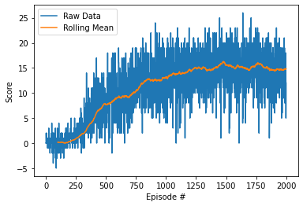
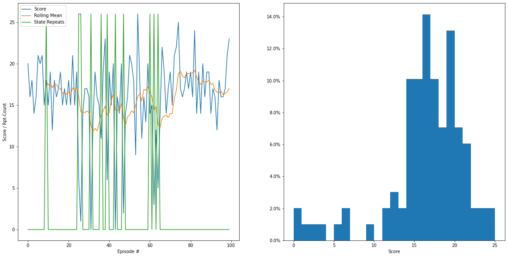
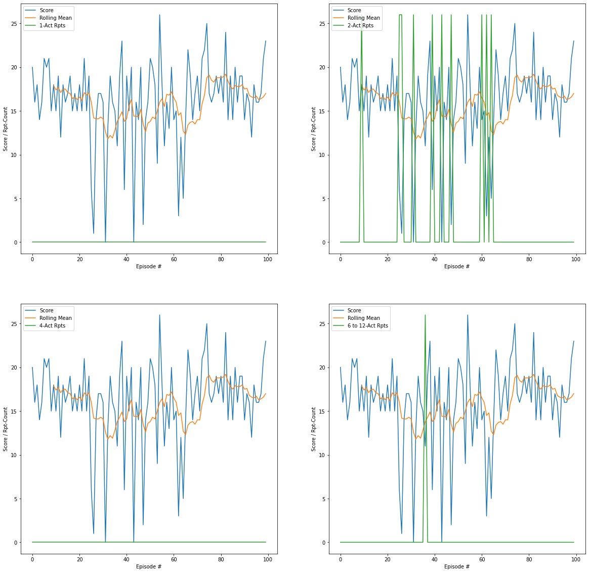
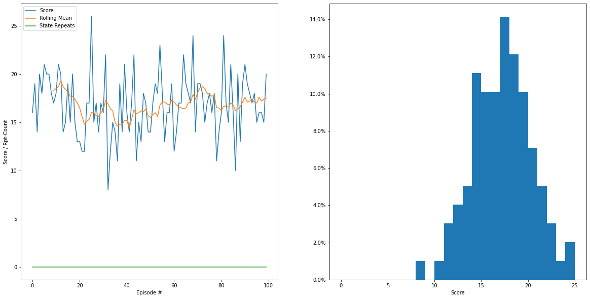
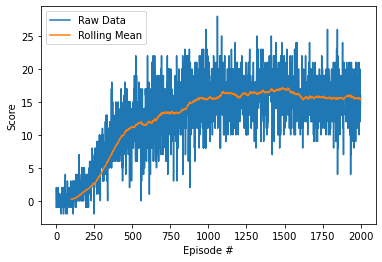
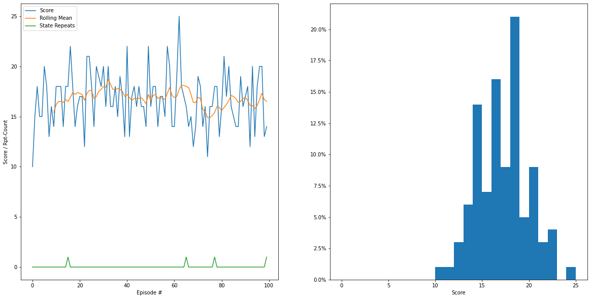

# Navigation Project Report
The goal of the project is to construct an agent and then train it to navigate the banana field to collect as many yellow bananas as possible while avoiding the blue bananas. This is equivalent to maximizing the score for an episode, which is defined as the cumulative sum of the rewards collected during the episode. The criterion for an agent to solve the environment is to get an average score of 13 or more in 100 consecutive episodes.

## Introduction

In this project, the agent is implemented by a value-based method, where the policy for selecting an action given the state is a greedy policy based on an estimated action-value function. The action-value function outputs the Q-values of the possible actions, where the Q-value for an action is the remaining return the agent is expected to obtain at the end of the episode using the greedy policy if the action is taken given the input state. The greedy policy selects the action with the maximum Q-value. Training such an agent is to estimate the action-value function. During training, the agent's actions are selected by an Epsilon-Greedy policy to allow for some explorations for improving the estimate of the action-value function, where with probability Epsilon, the action is randomly selected from all possible actions; and otherwise the action is selected using the greedy policy based on the current estimate of the action-value function. The estimate of the action-value function is continuously improved during many episodes of agent training.

An agent constructed and trained this way can obtain fairly good average performance over several episodes. However, the agent may still get very low score on some episodes. The issue is due to the action being selected using only the current state information. By incorporating state history information into the action selection process, the agent's performance can be further improved.

### Basic DQN architecture

In the implementation, the basic architecture of the agent is the [Deep Q-Network (DQN)](https://storage.googleapis.com/deepmind-media/dqn/DQNNaturePaper.pdf) developed by Volodymyr Mnih, et al. In the DQN architecture, the action-value function is estimated using a deep neural network. To facilitate agent training, two network models are used: the local model and the target model. The current state from the environment is used as the input to the local model to obtain the Q-values; and the action corresponding to the maximum Q-value will be selected. The action is applied to the environment to get to the next state and obtain a reward. The next state is then used as the input to the target model to obtain the maximum Q-value of all the possible next actions. This maximum Q-value is the return the agent is expected to get starting from the next state using the greedy policy. After applying a discount factor to this return, it is added to the reward to obtain the target Q-value of the selected action for the current state. The difference between the target Q-value and the Q-value obtained by the local model is used to update the network weights of the local model for training the agent. The target model will be periodically updated by the local model during the training of the agent.

For training the agent, an experience replay buffer is used to store a large collection of the agent's state, action, reward, next state, and done (which indicates whether the action's result is the end of episode). During training, the agent will apply the Epsilon-Greedy policy based on the local model to select its actions for many episodes. The agent's experience (state, action, reward, next state, and done) from each navigation step is stored in the experience replay buffer. The experiences are periodically sampled from the buffer to update the network weights of the local model.

### Improving DQN with Double DQN (DDQN)

In the original DQN, the next state is used as the input to the target model to obtain the Q-values of all the actions and then the maximum of them is used as the maximum Q-value to be combined with the reward to obtain the target Q-value. The [Double Q-Learning](https://arxiv.org/abs/1509.06461) algorithm developed by Hado van Hasselt, et al. improves on the DQN training method by modifying the process for obtaining maximum Q-value to be combined with the reward. With Double Q-Learning, the next state is used as the input to both the local and target models to obtain two sets of Q-values for the possible actions. Then the action corresponding to the maximum Q-value from the local model is used as the index to select the Q-value from the target model set to be combined with the reward. This improved DQN is also called Double DQN or DDQN.

### Improving DQN with Prioritized Experience Replay

Another improvement to the original DQN is the [Prioritized Experience Replay](https://arxiv.org/abs/1511.05952) algorithm developed by Tom Schaul, et al. With Prioritized Experience Replay, instead of uniformly sampling the experience replay buffer for training the local model, sampling is done according to a probability distribution based on the priorities assigned to the experiences. Experiences with higher priorities will be sampled more often. The priority assignments are based on the absolute difference between the target Q-value and the Q-value obtained by the local model during agent training and they are updated whenever experiences are used for training. In this project, the agent is implemented by Double DQN (DDQN) with Prioritized Experience Replay.

### Using state history to improve agent performance

The input to the DDQN is the observed external state vector provided by the environment. Since no state history information is used, this DDQN model doesn't handle repeated states after a short sequence of actions very well. If the state is repeated, the Q-values obtained by the DDQN will also be repeated and this will cause the agent to loop through the same sequence of actions forever.

To help alleviate the problem caused by repeated states, a method of tracking a short history of observed external states and simulated internal states (x-y positions and orientations) is developed. Tracking simulated internal states is kind of like using odometry with orientation information to track the position and orientation of a vehicle. Unlike odometry that uses wheel rotation for tracking, simulated internal state tracking is based on the actions taken by the agent. This history is used to post-process the actions ranked by the Q-values from the DDQN to avoid undesirable actions causing repeated states to improve the final scores. An alternative is to incorporate the history information into the external state vector by augmenting it with indicator vectors identifying the undesirable actions to be avoided. In training such a DDQN with augmented state vectors as inputs, the rewards stored in the experience replay buffer are modified by penalty values to discourage the undesirable actions. The rewards are only modified within the process of DDQN training and the original reward defined by the environment is not modified.

## Implementation Details

The base implementation for the agent is Double DQN (DDQN) with Prioritized Experience Replay. This implementation is then improved by post-processing the actions ranked by the output Q-values from the DDQN agent by keeping track of a short history of observed external states and simulated internal states. An alternative to post-processing is also implemented by augmenting the input state vector to the DDQN using the short history to enable the agent to directly avoid the undesirable actions identified by the history.

### DDQN with Prioritized Experience Replay

The deep neural network used for the local and target models is a fully connected network with two hidden layers. The ReLU activation function is used for the two hidden layers. The output dimension of the network is 4 (number of possible actions). The input dimension of the network is 37 (number of external state parameters). The tunable parameters with values used in parentheses are listed below.

#### Parameters for neural network model and its training

- hsize1 (64): Size of the first hidden layer.
- hsize2 (64): Size of the second hidden layer.
- lrn_rate (7.5e-5): Learning rate for training the neural network.

#### Parameters for DDQN

- BUFFER_SIZE (1e5): Size of the experience replay buffer.
- BATCH_SIZE (64): Number of samples used in each patch to train the local neural network model.
- GAMMA (0.99): Discount factor applied to the maximum Q-value of next state to obtain the target Q-value of current state.
- TAU (1e-3): Fractional amount of the parameter values to be kept when the target model is updated by the local model to keep the target model slightly different from the local model.
- LEARN_EVERY (4): The local model learns (to be trained) with one batch of experiences after every LEARN_EVERY steps of navigating the environment.
- UPDATE_EVERY (4): The target model is updated by the local model after UPDATE_EVERY batches of training.

#### Parameters for Prioritized Experience Replay

The implementation here uses the ranked based priorities. The priority of each experience is set to maximum when it is first added to the experience replay buffer. After an experience is used for training, its priority is updated by the absolute difference between the target Q-value and the Q-value from the local model for the current state. The bigger the absolute Q-value difference, the higher the priority is. However, the probability distribution used for sampling the experience is not directly based on the absolute Q-value difference. Instead, the absolute Q-value difference is used to rank the priorities of the experiences and the ranking indices (starting from 1) are used to obtain the probability distribution. The higher the ranking (the lower the ranking index), the higher the probability is. Instead of making the probability directly proportional to the reciprocal of the ranking, it is made to be proportional to the reciprocal of the ranking raised to the power of an exponent (`PRIO_ALPHA`).

Since the experiences are not uniformly sampled for training, when an experience is used for training to update the local model weights; its effect on the parameter updates should be corrected by an importance sampling weight. The importance sampling weight is proportional to the reciprocal of the sampling probability. According to [Tom Schaul, et al.](https://arxiv.org/pdf/1511.05952.pdf), instead of directly using the reciprocal of the sampling probability; it is also raised to the power of some exponent (Beta). They propose an annealing schedule for such Beta where it starts at `beta_start` at the beginning of training and linearly anneals to 1.0 at the end of training.

- PRIO_ALPHA (0.7): The exponent applied to the reciprocal of ranking to obtain sampling probability.
- beta_start (1.0): Starting Beta value for importance sampling (it is kept at 1.0 without annealing).

#### Parameters for Epsilon-Greedy agent training

- eps_start (1.0): Starting Epsilon value at start of training (set to 1.0 for full exploration).
- eps_end (0.01): Smallest Epsilon value to keep certain amount of exploration.
- eps_decay (0.995): Decay rate per episode for decreasing the Epsilon value during training.
- n_episodes (2000): Number of episodes used for training the DDQN model of the agent.

### Post-processing action candidates to improve DDQN agent

In navigating the environment, the agent may hit a wall and then is stuck there as shown in the tests in `Navigation.ipynb`. When this happens, the observed external state will remain the same. Since the input to the DDQN model is the observed external state, the agent won't be able to free itself once it is stuck. By keeping track of a history of two consecutive states, the condition of the agent being stuck can be detected by calculating the vector norm of the state difference. If the norm is less than a certain threshold (`tor_dstate`), the two states are considered essentially the same and the agent is stuck. If the action between the states is also known, that action should be avoided for the next action to free the agent.

Another problematic situation (also shown in `Navigation.ipynb`) is that the agent carries out a short sequence of actions that leads it back to the same state. Once the agent selects a sequence of such actions, it will continue to choose them effectively keeping the agent in the same place since the input states to the DDQN model are essentially the same. In this situation, detecting the state being repeated is not enough. Instead of taking the action and then detecting whether the state is repeated, it is desirable to predict the action that will lead to a repeated state so that it can be avoided.

In order to predict the actions leading to repeated states, a method for tracking a short history of simulated internal states (x-y positions and orientations) is developed. The angular span of a turn is determined to be one-twelfth of a circle as shown in the tests in `Navigation.ipynb`. For each action, the agent either changes the orientation by one-twelfth of a circle or the x-y position by `mcode*[cos(ori),sin(ori)]`, where `mcode` (move code) is either 1 for forward and -1 for backward and `ori` is the orientation angle. For a candidate action, it can be used to move the simulated internal state by one step and the resulting simulated internal state can be compared with the ones in the history to determine whether it will cause a repeated simulated internal state or not. If the action will cause a repeated simulated internal state, it is not desirable and should be avoided.

With a history of simulated internal states, the action between two consecutive states can also be recovered. If the orientation (`ori`) is different between the two simulated internal states, then the action in between is a turn and the difference between the `ori`'s can be used to resolve whether the turn is a left turn or right turn. Otherwise, the action is a move and the move code can be recovered from the difference of the x-y positions by `mcode = dot(mcode*[cos(ori),sin(ori)], [cos(ori),sin(ori)])`, where `dot` is the dot product of two vectors.

So a history of two observed external states and a number of simulated internal states can be used to post-process the action candidates ranked by the Q-values from the agent implemented and trained by DDQN with Prioritized Experience Replay. The number of simulated external states tracked is determined from a parameter, `post_srdet`, which is the number of the types of undesirable actions to be avoided. The type is specified by the number of actions between repeated states.

The parameters with values used in parentheses are listed below.

- tor_dstate (1e-3): Tolerance for detecting whether two states are different.
- post_srdet (7): It is set to 7 to detect and avoid repeated states separated by 1, 2, 4, 6, 8, 10, and 12 actions (7 types). So the size of the simulated internal state buffer is 12. Since the number of turns to complete a circle is even, except for state repeats separated by 1 action, it is not likely for state repeats separated by odd number of actions to happen; and they are not checked for post-processing.

### Input state augmentation to improve DDQN model

An alternative is to directly incorporate the mechanism for avoiding the undesirable actions into the DDQN. Like post-processing, the undesirable actions are obtained by tracking a short history of previous observed external states and simulated internal states (x-y positions and orientations). Unlike post-processing, indicators for these undesirable actions are used to augment the input state vector to the DDQN model. For each type of repeated state, with the type identified by the number of separating actions, an indicator vector of size 4 (number of possible actions) is added to the state vector. The values of the vector are 0 if there are no undesirable actions (i.e., no actions to avoid). If there is an undesirable action, the value at the vector position indexed by it is set to 1. To train the DDQN with such an augmented state as input, if an undesirable action (which can be identified by the 1's in the indicator vectors added to the original state vector) is taken; a penalty value is used to modify the original reward stored in the experience replay buffer for training the model. If the original reward is 0, it will be assigned the negative penalty value to discourage the undesirable action. The penalty values are specified by a list, `srpt_pens`, as shown below:

- srpt_pens = [-0.1, -0.1, -0.05, -0.05, -0.025, -0.025, -0.025]

It contains 7 values to discourage undesirable actions that will continue the repeated state separated by 1 action, and the actions that will cause repeated states separated by 2, 4, 6, 8, 10, and 12 actions, respectively. The input dimension of the deep neural network of this DDQN is 37 (number of external state parameters) + 7*4 (4 is the number of possible actions).

## Experimental Results

Details of the experiments carried out for this project are in `Navigation.ipynb`. The base DDQN with Prioritized Experience Replay is first trained and tested. Then the trained agent is tested with post-processing enabled. Finally, the DDQN (with Prioritized Experience Replay) using augmented input state vector is trained and tested.

### Results for DDQN

The agent is trained for 2000 episodes and the environment is first solved (achieved average score of 13 or more for 100 consecutive episodes) at Episode 871. For 2000 episodes, the best average score (for 100 consecutive episodes) is 16.27 achieved at Episode 1378. The scores from the training episodes are plotted below:

The best trained agent is then tested for 100 episodes. The average test score is 16.04, but the minimum score is 0. The test scores and the score histogram are plotted below. In addition to the score for each episode, the numbers of repeated states after 1, 2, 4, 6, 8, 10, and 12 actions are also obtained. The sum of these repeated state counts are plotted alongside the scores, where the state repeat counts are clipped to the maximum score to maintain the scale of the score plot. Repeated states separated by fewer number of actions are more problematic for the DDQN model since the slowly changing environment (the banana field in this case) will more likely break up the harmful loops of longer action sequences.

To show the details of the types of repeated states causing problems, the counts for the different number of actions between repeated states are separated. The plots for repeated states after 1, 2, 4, and 6 to 12 actions are shown below:

The results show that this DDQN agent can solve the environment fairly quickly; and the best average training score achieved with 2000 episode is quite good. The average test score from the best trained model is also quite good. However, its problem is that the agent obtains very low score in some episodes.

The plots for repeated state counts show strong correlation between low scores and high state repeat counts; and repeated states after 2 actions cause most of the problems. Repeated states separated by other number of actions also happen occasionally and they may also be harmful to the agent in preventing it from obtaining higher scores.

### Results for post-processing

When post-processing is enabled for testing, the average score for 100 episodes improved to 16.80. More importantly, the minimum score improved to 8. The plots for testing scores with repeat counts and score histogram is shown below, which show that the repeated states are eliminated.

### Results for DDQN with augmented input state

The DDQN model using the augmented state vector as input is also trained for 2000 episodes using the penalty values specified in `srpt_pens`. With the augmented state vector as DDQN input, the environment is first solved very quickly at Episode 581. The training average of the best trained model is 17.13, achieved at Episode 1384; which is very good. The scores from the training episodes are plotted below:

The best trained agent is also tested for 100 episodes. The average test score is 16.74 and the minimum score is 10, which is comparable to those obtained by post-processing the action candidates from the base DDQN model without state augmentation. The plots for testing scores with state repeat counts and score histogram are shown below, which also show that the repeated states are mostly eliminated. Only large number of repeated states are problematic since they keep the agent in the same place for a long time, but a small number of repeated states are acceptable. It is not possible to completely eliminate repeated states after 1 action. Such a repeat can only be discontinued after being detected once.

## Summary and Future Work

For this project, the following results are obtained:

- An agent with DDQN model trained with Prioritized Experience Replay was obtained. The trained agent achieved fairly good performance on average (i.e., when the scores from several consecutive episodes are averaged). However, the episode scores were sometimes very low from this agent.

- The experimental results showed strong correlation between low scores and high state repeated counts. So this verified a weakness of the DDQN using only the current observed external state provided by the environment as the input to the model.

- To help alleviate the problem caused by repeated states, a method was developed to track a short history of observed external states and simulated internal states (x-y positions and orientations). When such history was used to post-process the action rankings from the DDQN during testing, the average testing score improved. More importantly, the minimum episode score improved a large amount essentially resolving the problem of very low episode scores from the agent.

- As an alternative to post-processing, a method was developed to use the short history to augment the state vector used as the input to the DDQN. Experimental results from this DDQN model with history information showed that the agent's performance was comparable to that obtained by post-processing the action candidates from the DDQN model without state augmentation.

There are a large number of parameters that can be tuned for the models used in this project. To obtain the results presented here, only the learning rate (`lrn_rate`) for training the neural network model, the penalty values (`srpt_pens`) in training the DDQN with augmented input state, and the starting Beta (`beta_start`) (from 0.5 to 1.0) for obtaining the importance sampling weights were tuned in an ad-hoc manner. To understand the true characteristics of the DDQN models with Priority Experience Replay training, the post-processing technique, and DDQN with augmented input state vector; a future work direction is to systematically tune all of the parameters to see whether the agent's performance can be further improved.

Another future direction is to implement and test other algorithmic improvements to the DDQN models, which include the [Dueling DQN](https://arxiv.org/abs/1511.06581) architecture proposed by Ziyu Wang, et al.; and other techniques discussed in the [Rainbow Paper](https://arxiv.org/abs/1710.02298) by Matteo Hessel, at al.
